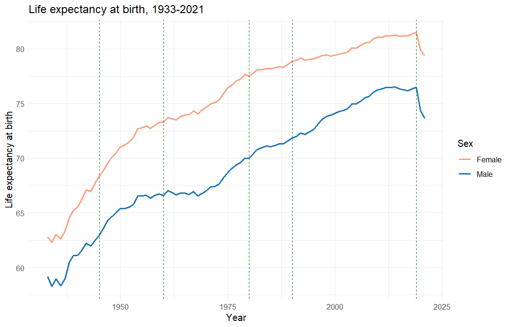
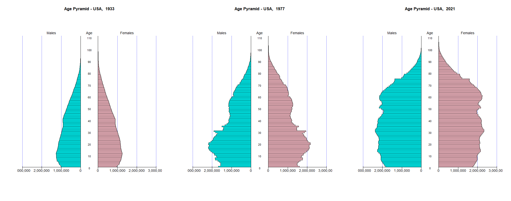
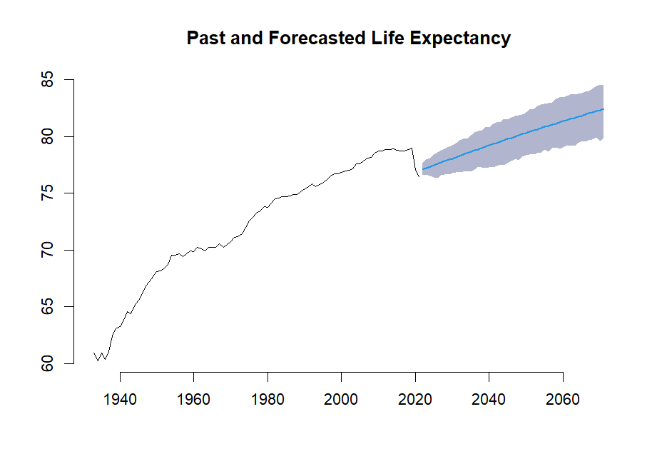

# The Demographic Transition in the United States

## Description
This project examines the demographic transition in the United States over the past century, focusing on how fertility and mortality patterns have evolved. It explores the influence of socio-economic factors, healthcare advancements, and cultural shifts on population dynamics. Using models such as Lee-Carter and Renshaw-Haberman, the project forecasts demographic trends for the next 50 years, providing valuable insights for policymakers in healthcare, insurance, and economic planning.

---

## Key Findings
- Life expectancy in the United States has increased significantly, driven by advancements in healthcare and public health measures.
- Fertility rates have declined post-World War II, reflecting societal shifts toward family planning, women’s empowerment, and career prioritization.
- The aging population presents challenges for healthcare systems, social security, and labor markets.
- The Renshaw-Haberman model, accounting for cohort effects, provided better mortality forecasts compared to the Lee-Carter model.

---

## Key Features
- **Historical Analysis**: Examination of fertility and mortality trends from 1933 to 2021.
- **Statistical Modeling**: Application of Lee-Carter and Renshaw-Haberman models for mortality analysis and life expectancy forecasting.
- **Data Exploration**: Insights into socio-economic factors, including GDP, education, and employment, that influence demographic changes.
- **Forecasting**: Projections of mortality rates and life expectancy for the next 50 years.
- **Visual Outputs**: Detailed visualizations, including population pyramids, mortality trends, and forecasted life expectancy.

---

## Folders Structure
- **`data/`**: Contains datasets used in the analysis.  
  - Files: `us.edu`, `us.emp`, `us.exp`, `us.gdp`, `us.mx`, `us.tfr`

- **`output/`**: Contains generated plots, tables, and results.  

- **`script.R`**: The R script that runs the entire analysis, including data preprocessing, modeling, forecasting, and visualizations.

---

## Visual Highlights
### Life Expectancy Trends


### Population Pyramid


### Forecasting



---

## Getting Started
### Prerequisites
Ensure the following tools are installed:
- R (version 4.0.0 or later)
- R packages: `dplyr`, `ggplot2`, `StMoMo`, `demography`, `forecast`, `gridExtra`

### Running the Analysis
1. Clone the repository:
   ```bash
   git clone https://github.com/chiara-cattani/Demographic-Transition-in-the-US.git
   cd Demographic-Transition-in-the-US
